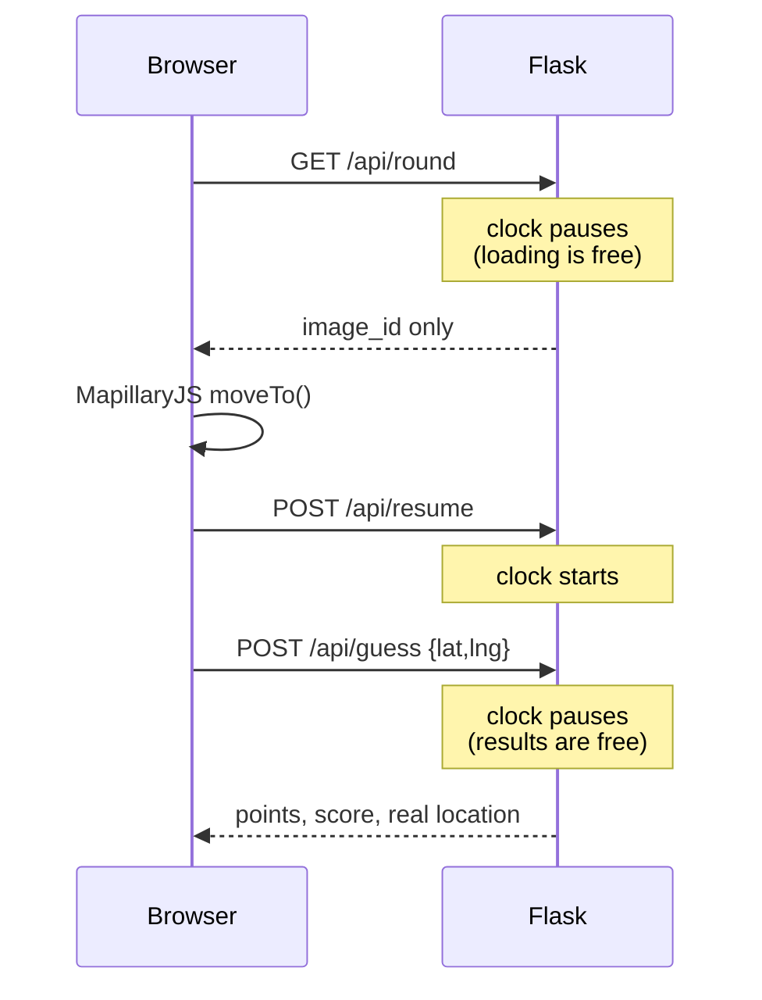

# GeoGuesser 360°

A GeoGuessr-style game built on open data. You're dropped into a 360° street
photo somewhere on Earth, you drop a pin on the world map, and you're scored on
how close you got.

No Google Street View, no paid APIs, no map keys — Mapillary for the imagery,
GeoNames for the places, Esri for the map tiles.

---

## How it works

The interesting problem is *finding* a random street photo. Mapillary's Graph
API can't answer "give me a random image" — and its bbox search returns
`500 Please reduce the amount of data you're asking for` for any bounding box,
even a 400 m one. So the app works backwards from a list of real places:

1. **Pick a city.** A population-weighted random draw from 34,124 GeoNames
   cities held in a local SQLite table. Bigger cities come up more often
   because they're likelier to have coverage.
2. **Probe for imagery.** Fetch that city's Mapillary vector tile at zoom 14 —
   the only zoom whose public tiles carry the `image` layer. A z14 tile is only
   ~1 km wide, so a city centre often lands just outside its own coverage; the
   app also probes up to 3 random neighbouring tiles and takes the first with
   at least 10 panoramas.
3. **Remember the answer.** The result is written back to the city's `pano`
   column, so a barren city is never fetched twice. **The game gets faster the
   more you play**, and that knowledge survives restarts.
4. **Serve it.** 300 panoramas are sampled from the tile and cached. A
   background thread keeps a rolling set of 24 warm cities stocked, so rounds
   after the first are instant rather than waiting on a ~10 MB tile download.

Only `is_pano` (spherical) images are used, so every round is a full 360° view.

The true coordinates never reach the browser — they live in the Flask session
until you guess, so they can't be read out of devtools.

### A round



---

## Setup

Requires Python 3.9+.

**1. Get a Mapillary token** — sign in at
[mapillary.com/dashboard/developers](https://www.mapillary.com/dashboard/developers),
register an app, and copy the client token (it starts with `MLY|`).

**2. Configure and install:**

```bash
echo 'MAPILLARY_TOKEN=MLY|your|token' > .env
pip install -r requirements.txt
```

**3. Run:**

```bash
python app.py
```

Open http://127.0.0.1:5000.

On first run the app downloads GeoNames `cities15000.zip` (~3 MB) and builds
`cities.db`. That happens once and takes a few seconds. Delete the file to
rebuild it from scratch.

---

## Playing

Drag inside the photo to look around and walk the arrows to move down the
street. Click the map bottom-right (it grows on hover), then **Guess** — the
map expands to full screen and shows the real location, the distance line, your
points and how far off you were. **Quit** in the top-left leaves any game.

### Single player

| Mode | Options | Ends when |
|---|---|---|
| **Time Attack** | 5 / 10 / 15 minutes | The clock runs out |
| **Fixed Rounds** | 5 / 10 / 15 / 30 rounds | You've used every guess |

In Time Attack the clock only runs while a street is actually on screen. It's
paused while a tile loads and while you're reading a result, so a slow download
never costs you time. The server is the authority on it; the browser countdown
is a mirror.

### Multiplayer

Always a **10-round match**, no options. **Create game** hands you a 10-character
code; anyone who enters it under **Join game** plays the same 10 locations in the
same order. The code also lives in the URL as `?g=CODE`, so that link is an
invite — open it and you join without typing anything.

The match moves in lockstep:

1. Everyone guesses. Your own points show immediately, but **Next round** stays
   disabled and reads *"Waiting for Player 2"*.
2. Once all have guessed, the button enables. Click it and it goes back to
   waiting until the others click too.
3. When the last player clicks through, the server advances and everyone's next
   street loads together.

A live scoreboard sits top-right, marking who is still guessing. Two ways a
match could otherwise deadlock are handled: a player silent for 90 seconds
stops counting toward the round, and someone joining mid-match sits out the
round in progress rather than stalling it. Quitting also releases the round.

Codes use a 31-character alphabet with `0`, `O`, `1` and `I` removed so nobody
mistypes one.

### Reloading

Refreshing mid-match drops you straight back in with your score and round
intact — the code in the URL plus the session cookie identify you, so no
duplicate player is created. The signing key is persisted to `.flask_secret`,
so sessions also survive a server restart (the in-memory games do not).

### Scoring

`points = 2000 × exp(−distance_km / 1500)`

Exponential decay, distance only — no country or continent matching, so a 2 km
guess across the Bosphorus scores 1,997 even though it's a different continent.

| Off by | Points |
|---|---|
| 0 km | 2,000 |
| 50 km | 1,934 |
| 250 km | 1,693 |
| 1,000 km | 1,027 |
| 3,000 km | 271 |
| 10,000 km | 3 |

The `1500` is GeoGuessr's constant (`5000 · exp(−10d / 14916 km`, the diagonal
of a world map). A linear curve was tried first and abandoned: the mean
distance between two random points on Earth is ~10,008 km, so a blind click
scored half marks, and being 250 km off cost only 1.25% versus a perfect guess.

---

## Tuning

All in [`app.py`](app.py):

| Constant | Default | Effect |
|---|---|---|
| `FALLOFF_KM` | `1500` | Lower punishes near misses harder |
| `MAX_SCORE` | `2000` | Points for a perfect guess |
| `MIN_POP` | `50000` | Lower for obscurer cities, at a worse coverage hit rate |
| `MIN_PANOS` | `10` | Minimum panoramas for a tile to count as covered |
| `WARM` maxlen | `24` | How many cities stay instantly available |
| `MP_ROUNDS` | `10` | Rounds in a multiplayer match |
| `STALE` | `90` | Seconds before a silent player stops holding up a round |
| `GAME_TTL` | `12 h` | How long an unused game code lives |

---

## Layout

```
app.py              Flask app: city selection, tile probing, scoring, routes
templates/          index.html — the whole front end, no build step
static/earth.mp4    title screen background
static/icons/       pin logo: favicon, touch icon, title mark
cities.db           generated on first run, not in git
.flask_secret       generated on first run, not in git
test_app.py         geo maths + city DB checks
```

## API

| Route | Purpose |
|---|---|
| `POST /api/start` | `{mode, limit}` — begins a solo game, resets the score |
| `GET /api/round` | Returns an `image_id`, stashes the answer in the session |
| `POST /api/resume` | Client says the street is on screen; starts the clock |
| `POST /api/guess` | `{lat, lng}` — scores it, returns the real location |
| `POST /api/quit` | Leaves the game and releases the round for everyone else |
| `POST /api/create` | Opens a 10-round multiplayer game, returns its code |
| `POST /api/join` | `{code}` — joins an existing game |
| `GET /api/state` | Whether this browser is still in a game (reload recovery) |
| `GET /api/sync` | Scoreboard plus who the round is waiting on |
| `POST /api/ready` | This player has seen the result; advances when all have |

## Tests

```bash
python test_app.py
```

Covers haversine against known distances, the tile ↔ lat/lon round-trip, and
`pick_city` eligibility.

---

## Notes and limits

- **Coverage** is roughly 70% of eligible cities after neighbour probing.
  Mapillary is crowd-sourced, so it's thin in China, much of India, and rural
  areas generally.
- **`static/earth.mp4` is 24 MB.** Re-encode before deploying anywhere real:
  `ffmpeg -i static/earth.mp4 -c:v libx264 -crf 30 -an -movflags +faststart out.mp4`
- **Multiplayer games live in memory** and are pruned after 12 hours, so a
  server restart drops any match in progress. Moving `GAMES` into the SQLite
  file already sitting next to it would fix that. Players are auto-named
  "Player 1/2/3" by join order — no names, no accounts, no leaderboard.
- **No lobby.** Players start whenever they like, the way a challenge link
  works; there is no "wait for everyone, host presses Go" step.
- **Dev server only.** `app.run(debug=True)` — put it behind a real WSGI server
  if it ever leaves localhost, and set `SECRET_KEY` so sessions survive
  restarts.

## Credits

Imagery [Mapillary](https://www.mapillary.com) · Places
[GeoNames](https://www.geonames.org) (CC BY 4.0) · Map tiles Esri ·
Viewer [MapillaryJS](https://mapillary.github.io/mapillary-js/) · Map
[Leaflet](https://leafletjs.com)
